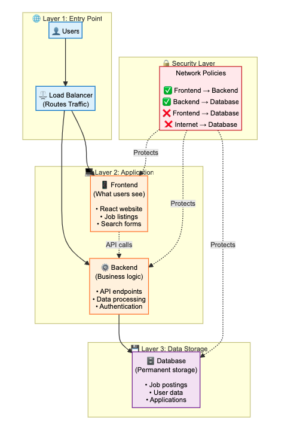

# Job Board - Full Stack Application on AWS EKS

A production-ready full-stack job board application deployed on AWS Elastic Kubernetes Service (EKS) using Kubernetes, Terraform, and modern DevOps practices.

## 📋 Project Overview

This project demonstrates a complete cloud-native application deployment featuring:

- **Frontend**: React.js job board interface
- **Backend**: Node.js/Express REST API
- **Database**: PostgreSQL with persistent storage
- **Infrastructure**: AWS EKS cluster managed with Terraform
- **CI/CD**: Automated deployment pipelines

## 🏗️ Architecture



### High-Level Components:
- **Layer 1**: Application Load Balancer (Public Entry Point)
- **Layer 2**: React Frontend & Node.js Backend (Application Layer)
- **Layer 3**: PostgreSQL Database (Data Layer)
- **Security**: Kubernetes Network Policies, IAM Roles, Security Groups

### AWS Resources:
- ✅ EKS Cluster (Managed Kubernetes)
- ✅ EC2 Worker Nodes (Auto-scaling)
- ✅ ECR Repositories (Private Docker Registry)
- ✅ VPC with Public/Private Subnets
- ✅ Application Load Balancer
- ✅ EBS Volumes (Persistent Storage)
- ✅ IAM Roles & Policies

## 🚀 Quick Start

### Prerequisites

- **AWS Account** with appropriate permissions
- **AWS CLI** configured with credentials
- **kubectl** - Kubernetes command-line tool
- **Terraform** (>= 1.0)
- **Docker**

### Installation & Deployment

#### 1. Clone the Repository
```bash
git clone https://github.com/tobiakinLade/job-board
cd job-board

2. Infrastructure Provisioning
bash

cd terraform
terraform init
terraform plan
terraform apply -auto-approve

3. Configure Kubernetes Access
bash

aws eks update-kubeconfig --region eu-west-2 --name job-board-eks
kubectl get nodes  # Verify cluster connection

4. Build and Push Docker Images
bash

chmod +x push-to-ecr.sh
./push-to-ecr.sh

5. Deploy to Kubernetes
bash

chmod +x deploy-to-eks.sh
./deploy-to-eks.sh

6. Access Your Application
bash

kubectl get ingress job-board-ingress -n job-board
# Use the provided URL to access your job board

📁 Project Structure
text

job-board/
├── frontend/                 # React application
│   ├── src/
│   ├── public/
│   └── package.json
├── backend/                  # Node.js/Express API
│   ├── src/
│   ├── routes/
│   └── package.json
├── terraform/               # Infrastructure as Code
│   ├── main.tf
│   ├── variables.tf
│   └── outputs.tf
├── kubernetes/              # Kubernetes manifests
│   ├── namespace.yaml
│   ├── configmap.yaml
│   ├── secrets.yaml
│   ├── pvc.yaml
│   ├── postgres-statefulset.yaml
│   ├── backend-deployment.yaml
│   ├── frontend-deployment.yaml
│   ├── ingress.yaml
│   └── network-policies.yaml
├── scripts/
│   ├── push-to-ecr.sh
│   └── deploy-to-eks.sh
└── docker-compose.yml       # Local development

🔧 Kubernetes Resources

The application uses the following Kubernetes resources in dependency order:

    Namespace - Logical isolation

    ConfigMap & Secrets - Application configuration

    PersistentVolumeClaim - Database storage

    StatefulSet - PostgreSQL database

    Deployment - Backend API

    Deployment - Frontend application

    Service - Internal networking

    Ingress - External access (ALB)

    NetworkPolicy - Security rules

🛠️ Development
Local Development
bash

docker-compose up

Access the application at http://localhost:3000
Environment Variables

Create .env files for local development:

    frontend/.env

    backend/.env

Testing
bash

# Backend tests
cd backend
npm test

# Frontend tests
cd frontend
npm test

📚 Detailed Guide

For a complete step-by-step deployment guide with explanations of each component, check out the full article:

Deploying a Full-Stack Application to AWS EKS: A Complete Kubernetes Guide

The guide covers:

    Kubernetes resource dependencies and deployment order

    AWS EKS integration and best practices

    Network security with Calico policies

    Infrastructure as Code with Terraform

    Production deployment strategies

🎯 Features

    Job Listings: Browse and search job opportunities

    Job Posting: Create new job listings

    Responsive Design: Mobile-friendly React interface

    RESTful API: Clean backend architecture

    Persistent Data: PostgreSQL with EBS storage

    Auto-scaling: Horizontal Pod Autoscaler ready

    Load Balancing: AWS ALB with path-based routing

    Security: Network policies, IAM roles, encrypted storage

🔒 Security

    Kubernetes Network Policies restrict pod-to-pod communication

    IAM Roles for Service Accounts (IRSA) for fine-grained AWS permissions

    Security Groups control network access

    Secrets management for sensitive data

    Private ECR repositories for Docker images

📈 Monitoring & Logging
bash

# View application logs
kubectl logs -l app=backend -n job-board -f
kubectl logs -l app=frontend -n job-board -f

# Check resource usage
kubectl top pods -n job-board
kubectl top nodes

🧹 Cleanup

To avoid ongoing charges, destroy the infrastructure:
bash

# Delete Kubernetes resources
kubectl delete namespace job-board --ignore-not-found=true

# Destroy Terraform infrastructure
cd terraform
terraform destroy -auto-approve

🐛 Troubleshooting

Common issues and solutions:
Pods in CrashLoopBackOff
bash

kubectl describe pod <pod-name> -n job-board
kubectl logs <pod-name> -n job-board

Database Connection Issues

    Verify DB_HOST in ConfigMap matches service name

    Check PostgreSQL logs: kubectl logs -l app=postgres -n job-board

ALB Not Provisioning

    Check Ingress resource: kubectl get ingress -n job-board

    Verify AWS Load Balancer Controller is installed

Image Pull Errors

    Re-authenticate with ECR: aws ecr get-login-password --region eu-west-2 | docker login...

    Verify image exists in ECR repository

🤝 Contributing

    Fork the repository

    Create a feature branch: git checkout -b feature/new-feature

    Commit your changes: git commit -am 'Add new feature'

    Push to the branch: git push origin feature/new-feature

    Submit a pull request

📄 License

This project is licensed under the MIT License - see the LICENSE file for details.
👨‍💻 Author

Tobi Akinlade

    Medium: @tobi.akinlade.co

    GitHub: @tobiakinlade

🙏 Acknowledgments

    AWS EKS team for managed Kubernetes service

    Kubernetes community for excellent documentation

    Terraform for Infrastructure as Code capabilities

⭐ If you found this project helpful, please give it a star!
text


This README provides:

1. **Clear project overview** and architecture
2. **Step-by-step deployment instructions**
3. **Direct link to your Medium article** for detailed explanations
4. **Comprehensive project structure**
5. **Troubleshooting section** for common issues
6. **Cleanup instructions** to avoid AWS charges
7. **Professional formatting** with emojis and sections

The README effectively complements your Medium article by giving users a practical guide to deploy the project while driving traffic to your detailed technical write-up.
# CI/CD trigger
# CI trigger 1763740032
